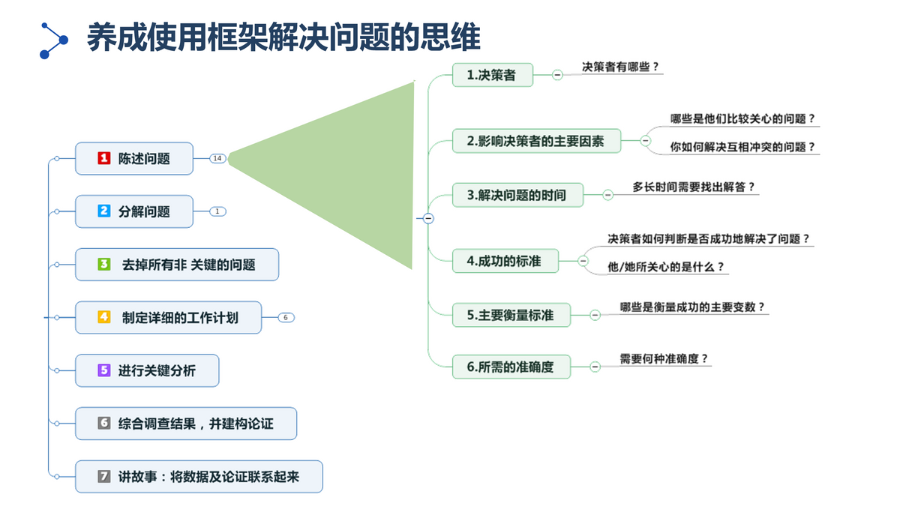

# life's routes and notes

<https://github.com/jichenghu/guideline>

<https://gitee.com/guideline/guideline>

参考文档：
* <https://www.toutiao.com/i6936754449570349572/>

参考视频：
* [子弹笔记](https://www.bilibili.com/video/av92667462/)

*********************

3 种笔记：记事笔记、问题笔记和复盘笔记。

* 记事笔记 ―― 工作的事件流水
* 问题笔记 ―― 促进访谈、调研、方案设计过程中带着问题思考，从而找出真正的问题及解决措施
* 复盘笔记 ―― 总结整理工作中的知识经验不断提升工作水平

## 1 记事笔记

记录事件发生的时间、起因、经过和结果，尽量详细记录这些要素。
无需精确排版和美化格式，可使用 OneNote 来进行，方便在任意位置输入内容，
包括文字、图标、语音、图片及手绘等，还可以插入录音、照片加以说明。

使用 OneNote，可以在 PPT 种选择发送到 OneNote。这样，对 PPT 的所有批注、
随手记录的内容、手绘等，都能在 OneNote 中进行记录，还能自动连接到对应的 PPT。

**OneNote 的待办跟踪功能：**

使用 OneNote 可以把某些事件记录为任务跟踪，方便日后查看时不仅能查阅情况，
还能检查哪些事情未完成。

**技巧：**

将大任务分解为当天能完成的子任务。

**例子：**

如果是“XX公司智能工厂设计咨询”这样的笔记，当然会导致很长时间的笔记都是同样的内容，
所以要进一步细化拆分：

* 首先，按流程或工作步骤拆分，比如上面的问题可以拆分为：
    * XX公司智能工厂建设背景
    * what（现状是什么？存在哪些痛点）
    * Why（为什么要建设智能工厂）
    * How（如何建设，需要哪些措施，投入产出概算）

* 然后，对拆分后任务按 MECE 法则进行细化，对于解决 what（现状是什么？存在哪些痛点）问题，
需要将任务拆分到更细，比如现状调研中，我们可以拆分为：

    （1）行业趋势是什么？

    （2）行业发展思路是什么？

    （3）行业领先实践有哪些他们怎么做的？

    （4）公司领导层的管理反思是什么？

* 最后，对最末级的问题清单，可以用头脑风暴法想到什么就记录什么，不追求完整体系，
比如我们要编写细到部门的需求调研提纲：
    * 结合 X 部门的业务编写调研提纲
    * 针对该部门的业务，同行或领先实践有哪些
    * 在这些方面，该部门都做了哪些工作？有哪些需求？有哪些改进建议等

这样的笔记，不仅仅是记录，更是促进你思考问题的过程，也能更好地为问题笔记服务。

## 2 问题笔记

解决问题的能力是老板或客户愿意付钱的原因，因此，在与客户沟通、访谈过程中的笔记，需要带着问题去思考，
推荐一个我最常用的方法：麦肯锡笔记思考法，边做笔记边思考问题的解决流程，边做笔记边为后续的汇报做准备，
至于详细的会议纪要会由专人负责，比如实习生，也可以借助用讯飞语记等工具。

### 2.1 要做好问题笔记，首先要养成使用框架解决问题的思维

如下面的思维导图中，我们会发现，真正的问题导向，最关键的是要准确地陈述问题，南辕北辙的事情在工作中也很常见。
可以利用5W2H来陈述问题，即问题的决策者是谁？影响他们的因素有哪些，问题需要在什么时候解决，
如何评判问题得到有效解决等。

再比如分析问题时，我们要去掉非关键问题和非关键因素，否则我们的问题笔记无限延伸，去掉非关键问题，
才能让我们更加集中资源和精力来解决关键性问题。

### 2.2 实时检试问题笔记的目的，按5个步骤建立问题笔记的故事线

要养成习惯：问题笔记的关键在于整理思路，对思考进行深入挖掘，同时将自己的思考可视化，使之变得更加清晰，
从而对真正的问题找出解决办法和思路，并随时记录在案。

利用黄金圈法则，即问题是什么(What)，为什么这样做(Why)，如何做（人、时间、步骤）(How)来做问题笔记，
以便将散乱的信息和问题联系起来，并且做出结构化的整理，最终形成问题-解决方案-故事解说的金字塔结构。

#### 第一步、明确真正的问题，抓大放小，避免头发胡子一把抓

#### 第二步、建立问题假设，提高问题的解决效率和解决方法的针对性

#### 第三步 验证假设，确认假设或推翻假设

 1. 事前在笔记上做好提问列表，为对第一步“分组整理”的Where（问题所在）， Why（原因），How（对策）提问，请注意，所有的提问，都是为了验证假设是否能解决真正的问题。

 2. 带着假设和笔记本亲自前往现场验证假设。

 3. 在现场通过不断的追问让提问进一步升华。

#### 第四步，构建问题-解决方案-故事线的金字塔结构

第五步，形成问题的解决方案，为汇报做准备。

问题笔记的目的不仅仅只是记录问题、问题解决思路的形成过程（提出假设、验证或推倒假设、
验证方案）以及问题的最终解决方案，还要做好汇报准备。

这里给出一条非常重要的建议：

一个图表，一条信息，即不管资料有多少页，一页资料中想要表达的内容只能有一个。

## 3 复盘笔记

复盘的重要性不言而喻，要不然就成了黑瞎子掰苞米，很多知识技能如果不复盘，不动手实战，
往往就只是“听说过”、“知道”而已，这也是我的专栏不推荐视频而推荐文章的一个关键原因，
看视频的时候大脑是不怎么思考的，而对于文章，需要我们认真地阅读和思考，在脑海中往往会留下更深的印迹。

2018至2019这两年，有很长一段时间，我每天都会看一份同事写的项目咨询报告，差不多读了上百份咨询PPT，
要知道，我们做的管理咨询项目，PPT都是100页起步的，要看懂并理解、消化、转化为自己的知识，
是需要很长时间的，这时候，每周的复盘笔记就非常重要了。

### 3.1 分组分类

管理咨询项目的内容逻辑从总体上大致相同的套路，但每个PPT都带有顾问的风格，比如内容的组织方式、展示方式，
甚至PPT风格，每个顾问都有自己熟悉的味道，因此分组分类是复盘笔记中最重要的内容，同一个知识点，
比如咨询报告的方法步骤（方法论），比如如何在PPT的前几页引出结论（结论先行），
再比如如何分析领先实践中的关键点和亮点（痛点分析），再比如如何收集调研问卷（很多问卷都大同小异，
收集整理后可以成为自己的问题库）、如何展示客户的需求，如何表达项目的进度计划（甘特图）等。

### 3.2 资料清洗

学习是需要有针对性的，有些人喜欢收集各种各样的资料和知识技能，但很多都束之高阁，
电脑成了各种资料的垃圾场，因此在分组分类的基础上，有必要对所有的资料进行清洗。

什么是资料清洗呢？就是对资料运用批判性思维，达到去伪求真的过程，
一味地拿来主义往往会导致自己成为一个知识的搬运工，搬运了半天自己什么都没有留下，清洗时，
一方面同一分类的内容很多，需要留下有价值的内容，删掉那些没有多少营养的、普适性的资料，
不行你可以用Everything试试，你输入几个关键字，会发现电脑上搜出很多内容雷同的东西，
这些内容无法成为你后续的知识库，只会成为资料垃圾。

### 3.3 构知识库

构建自己的知识库是我认为最有价值的一件事，你收集到的好文章（比如大神的咨询报告、今后可以直接套用）、
好素材（比如优秀的PPT图表、模板、配色、表达方式等）、实用技巧（比如访谈沟通技巧、PPT制作技巧等），
需要分类整理并做好登记，后续工作中可以直接套用。

一个非常经典的例子，我们团队的实习顾问能够在几周或1、2个月内就能独立展开调研和编写报告，
最大的关键是就是有公司的知识库KX以及团队领导分享的各种方法论、咨询报告等内容，只要多请几顿饭，
我们都很乐意分享给他们，可以毫不夸张地说，知识库的大小，决定了一个项目的项目周期，
如果是类型相同、客户雷同的项目，比如我们的IT规划，有些项目，项目才启动，有些资料就已经准备要交付了。

你知道吗？埃森哲公司的很多顾问电脑上都会插一个移动硬盘，所有有价值的案例、资料、技巧、模板，
都存在这个移动硬盘中，我们称之为移动的知识库，这个知识库，很多时候成了项目中标、快速实施、成功交付、
快速落地的关键要素之一。

## 4 更多文章

细节决定能否升职加薪，教你正确准备会议、写纪要、发邮件

[84页《埃森哲流程创造价值》方法论PPT，总经理、运营总监必读](http://toutiao.com/item/6791352126153949704/)

[述职报告不够高大上？套用这套149页模板+素材，分分钟搞定，转发](http://toutiao.com/item/6771747273807233544/)

[华为为什么那么牛？看看人家的专业销售培训和7个成交法，转发](http://toutiao.com/item/6750993029273747976/)

[拆书：麦肯锡结构化战略思维：如何想清楚、说明白、做到位](https://www.toutiao.com/item/6918659619535585799/)

